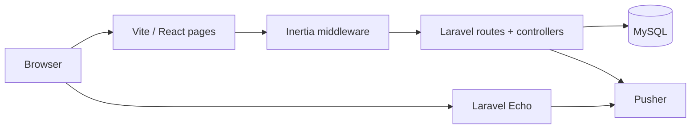

# Pixel Chat

Real-time group chat built on **Laravel 11**, **Inertia.js**, and **React** (TypeScript). Users browse conversations, open a room, and exchange messages with **Laravel Echo** and **Pusher** for live updates. **Laravel Breeze** provides authentication; **Spatie Laravel Media Library** handles attachments on messages (with image/video conversions).

## Stack

| Layer | Technology |
|--------|------------|
| Backend | PHP 8.2+, Laravel 11 |
| Frontend | React 18, TypeScript, Vite 5 |
| Bridge | Inertia.js, Ziggy (named routes in JS) |
| Styling | Tailwind CSS, Headless UI, Heroicons |
| Real-time | Pusher, Laravel Echo |
| Auth | Laravel Sanctum (session), Breeze controllers |
| Media | spatie/laravel-medialibrary, php-ffmpeg (conversions) |
| Optional storage | AWS S3 (`league/flysystem-aws-s3-v3`) |
| Tests | Pest, Laravel test utilities |

## Architecture



- **Server-rendered shell**: `resources/views/app.blade.php` loads the Vite bundle; Inertia swaps page components without full reloads.
- **Pages** live under `resources/js/Pages/**` and map 1:1 to `Inertia::render('…')` names (e.g. `Pages/Conversation/Index.tsx` → `Conversation/Index`).
- **Shared props** (e.g. `auth.user`) are set in `app/Http/Middleware/HandleInertiaRequests.php`.
- **Broadcasting** is authorized in `routes/channels.php` (`chat.{id}`, `user-rooms.{id}`, user private channel). Echo is configured in `resources/js/bootstrap.ts` from `VITE_*` Pusher variables.

## Folder structure

### Top level

```
pixel-chat/
├── app/                    # Application code (models, HTTP, events, helpers)
├── bootstrap/              # `app.php` — framework bootstrap, middleware, routes
├── config/                 # Laravel & package config (app, database, broadcasting, media-library, …)
├── database/
│   ├── factories/
│   ├── migrations/
│   └── seeders/
├── docker/                 # PHP / MySQL images and related Docker assets
├── public/                 # Web root (`index.php`, static assets, compiled frontend)
├── resources/
│   ├── css/
│   ├── js/                 # Inertia + React (TypeScript) source
│   └── views/              # Blade templates (Inertia shell)
├── routes/                 # `web.php`, `auth.php`, `channels.php`, `console.php`
├── storage/                # Logs, cache, sessions, uploads (runtime; not all tracked in git)
├── tests/                  # Pest — Feature + Unit
├── artisan
├── composer.json
├── package.json
├── vite.config.js
├── tailwind.config.js
├── postcss.config.js
└── tsconfig.json
```

### `app/`

```
app/
├── Events/                 # Broadcasting events (e.g. messages, room membership)
├── Helpers/                # Shared PHP helpers (e.g. encryption utilities)
├── Http/
│   ├── Controllers/
│   │   ├── Auth/           # Breeze — login, register, password, verification
│   │   ├── ConversationMemberController.php
│   │   ├── CoversationController.php
│   │   ├── MessageController.php
│   │   ├── NicknameController.php
│   │   ├── ProfileController.php
│   │   └── Controller.php
│   ├── Middleware/
│   │   ├── CustomConfirmPassword.php
│   │   └── HandleInertiaRequests.php
│   └── Requests/
│       ├── Auth/
│       └── ProfileUpdateRequest.php
├── Models/
│   ├── Conversation.php
│   ├── ConversationMember.php
│   ├── Message.php
│   └── User.php
└── Providers/
    └── AppServiceProvider.php
```

### `resources/`

```
resources/
├── css/
│   └── app.css             # Tailwind entry; imported from `resources/js/app.tsx`
├── js/                     # Inertia + React (TypeScript) — see next section
└── views/
    └── app.blade.php       # HTML shell; `@vite` + Inertia root `<div id="app">`
```

### `resources/js` — Inertia frontend

This folder is the **Vite entry** (`vite.config.js` → `resources/js/app.tsx`). Laravel controllers return `Inertia::render('Some/Page', props)`; the first argument is a **path under `Pages/` without extension**, using `/` instead of nested folders (e.g. `Chat/Chat` → `Pages/Chat/Chat.tsx`).

**Bootstrapping**

| File | Role |
|------|------|
| `app.tsx` | `createInertiaApp`: resolves `./Pages/${name}.tsx` via `import.meta.glob`, wraps the app in `NetworkProvider`, sets document title from `VITE_APP_NAME`. |
| `bootstrap.ts` | Default Axios setup (`X-Requested-With`), `window.Echo` + Pusher from `VITE_PUSHER_*` env vars. |

**Folder roles**

| Folder | Purpose |
|--------|---------|
| `Pages/` | **Inertia pages only** — one default export per file; names mirror `Inertia::render()` strings. Subfolders group by feature (Auth, Chat, Conversation, Profile). `Partials/` holds page-specific fragments (forms, modals) that are not top-level Inertia pages. |
| `Layouts/` | Shells wrapped around pages (`AuthenticatedLayout`, `GuestLayout`) — navigation, headers, Breeze-style chrome. |
| `Components/` | Shared presentational pieces (buttons, inputs, modals, `MessageCreator`, `TypingIndicator`, `NetworkStatus`, etc.) used across pages. |
| `Context/` | React context providers (e.g. `network-context.tsx` for online/offline or connectivity). |
| `Hooks/` | Reusable hooks (`useDebounce`) and small hook-style helpers (`Helper.tsx`). |
| `types/` | Ambient and shared TS types: `global.d.ts` (e.g. `window` extensions), `vite-env.d.ts` (`ImportMeta.env`), `index.d.ts` for app-wide types. |

**Full tree**

```
resources/js/
├── app.tsx
├── bootstrap.ts
├── Components/
│   ├── ApplicationLogo.tsx
│   ├── Checkbox.tsx
│   ├── DangerButton.tsx
│   ├── Dropdown.tsx
│   ├── InputError.tsx
│   ├── InputLabel.tsx
│   ├── MessageCreator.tsx
│   ├── Modal.tsx
│   ├── NavLink.tsx
│   ├── NetworkStatus.tsx
│   ├── OnlineStatus.tsx
│   ├── PrimaryButton.tsx
│   ├── ResponsiveNavLink.tsx
│   ├── SecondaryButton.tsx
│   ├── TextInput.tsx
│   └── TypingIndicator.tsx
├── Context/
│   └── network-context.tsx
├── Hooks/
│   ├── Helper.tsx
│   └── useDebounce.tsx
├── Layouts/
│   ├── AuthenticatedLayout.tsx
│   └── GuestLayout.tsx
├── Pages/
│   ├── Auth/
│   │   ├── ConfirmPassword.tsx
│   │   ├── ForgotPassword.tsx
│   │   ├── Login.tsx
│   │   ├── Register.tsx
│   │   ├── ResetPassword.tsx
│   │   └── VerifyEmail.tsx
│   ├── Chat/
│   │   ├── Partials/
│   │   │   └── AddUser.tsx
│   │   ├── Chat.tsx
│   │   └── ChatDetails.tsx
│   ├── Conversation/
│   │   ├── Partials/
│   │   │   ├── CreateNickname.tsx
│   │   │   └── NewRoom.tsx
│   │   └── Index.tsx
│   ├── Profile/
│   │   ├── Partials/
│   │   │   ├── DeleteUserForm.tsx
│   │   │   ├── UpdatePasswordForm.tsx
│   │   │   └── UpdateProfileInformationForm.tsx
│   │   └── Edit.tsx
│   ├── Dashboard.tsx
│   └── Welcome.tsx
└── types/
    ├── global.d.ts
    ├── index.d.ts
    └── vite-env.d.ts
```

### Routes, tests, and Docker

```
routes/
├── web.php                 # Conversations, chat, profile, redirects
├── auth.php                # Breeze authentication routes
├── channels.php            # Private / presence channel authorization
└── console.php

tests/
├── Pest.php
├── TestCase.php
├── Feature/
│   ├── Auth/               # Registration, login, password, email verification, …
│   ├── ProfileTest.php
│   └── ExampleTest.php
└── Unit/
    └── ExampleTest.php

docker/
├── mysql/
└── php/                    # PHP-FPM / Alpine variants used for containerized setups
```

## Main HTTP flows

- **`/`** → redirect to **`/conversation`** (conversation list / entry).
- **`/conversation`** — list and create conversations; guest nickname via **`POST /nickname`**.
- **`/chat/{chatID}`** — message UI; protected by auth and **`CustomConfirmPassword`** on GET; **`POST /chat/{chatID}`** sends messages (throttled).
- **`/chat/details/{chatID}`** — room metadata.
- **Members**: **`POST /coversation/add-user`**, **`POST /coversation/leave/{chatID}`** (password confirm).
- **Profile** — Breeze-style **`/profile`** (edit / update / destroy).
- **`/dashboard`** — Inertia `Dashboard` (auth + verified).

> Note: some route paths use the historical spelling `coversation` in the URL; names use `conversation` where applicable.

## Local development

Prerequisites: PHP 8.2+, Composer, Node 18+, MySQL (or adjust `.env`), and a Pusher (or compatible) app for real-time features.

1. **Environment**

   ```bash
   cp .env.example .env
   php artisan key:generate
   ```

   Fill database credentials, `APP_URL`, and Pusher / `VITE_*` values. See `.env.example` for the full list (including optional `AWS_*` for S3).

2. **Backend**

   ```bash
   composer install
   php artisan migrate
   # optional
   php artisan db:seed
   ```

3. **Frontend**

   ```bash
   npm install
   npm run dev
   ```

4. **App server** (separate terminal)

   ```bash
   php artisan serve
   ```

   Visit the URL shown by `serve` (and ensure Vite is running for hot reload).

**Production build:** `npm run build` then deploy with a web server pointed at `public/`.

**Checks:** `npm run check` runs TypeScript; `./vendor/bin/pest` runs tests.

## License

This project inherits the **MIT** license from its Laravel-based dependencies and application skeleton (see `composer.json`).
